# Day 05 - Linux + Nginx Lab

This repository contains my practical engineering labs for Linux + Nginx.

## Labs Completed
- Environment discovery
- SSH access
- Nginx installation
- Custom webpage deployment
- Firewall configuration
- Connectivity testing
- Logs inspection
- Troubleshooting and recovery

## Evidence
Screenshots and notes are included in this folder.

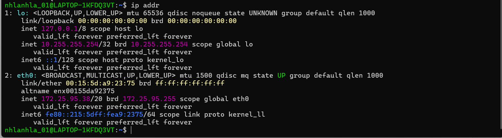

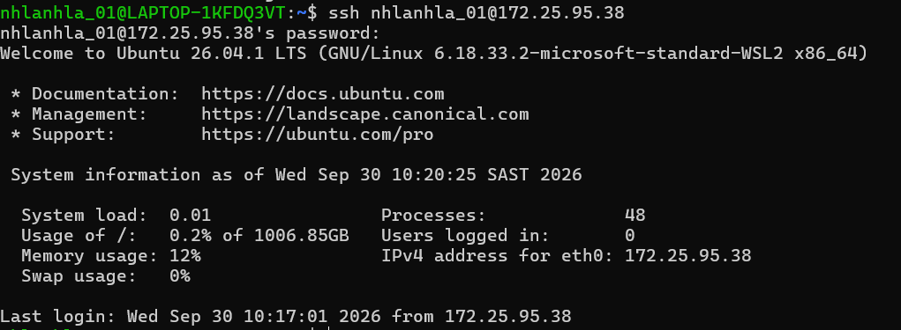
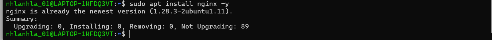
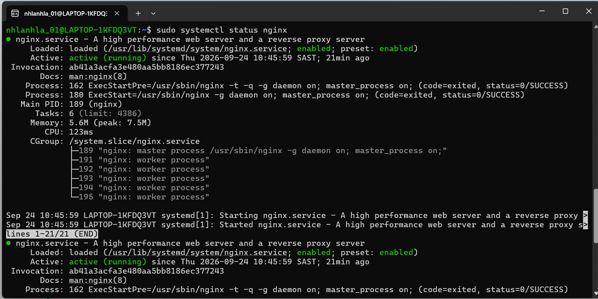
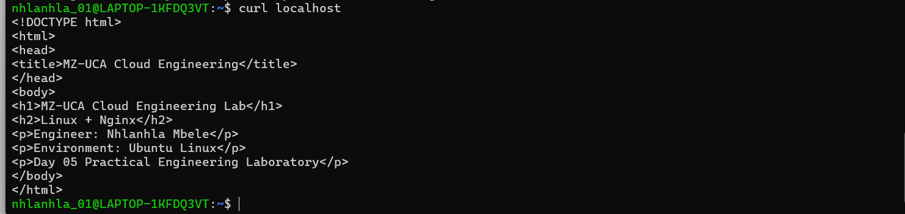
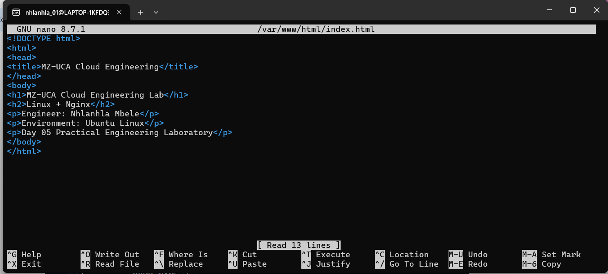
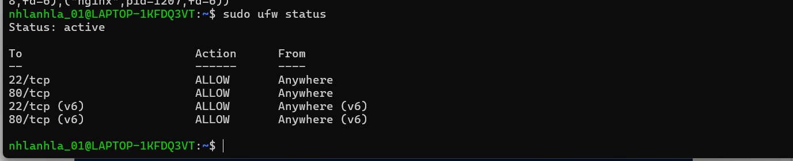
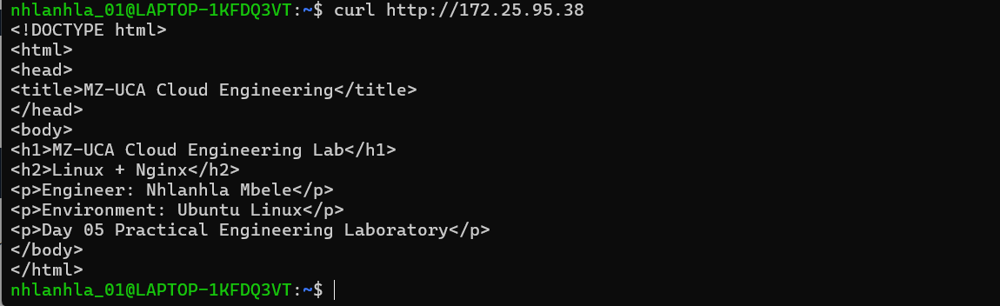
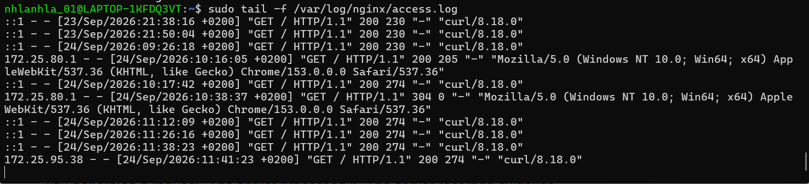
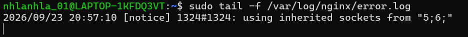
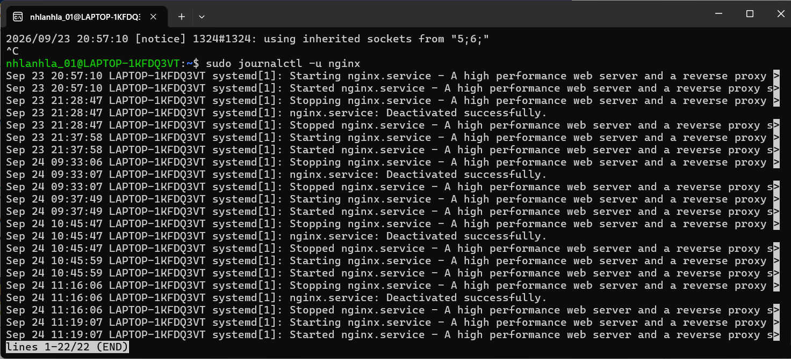

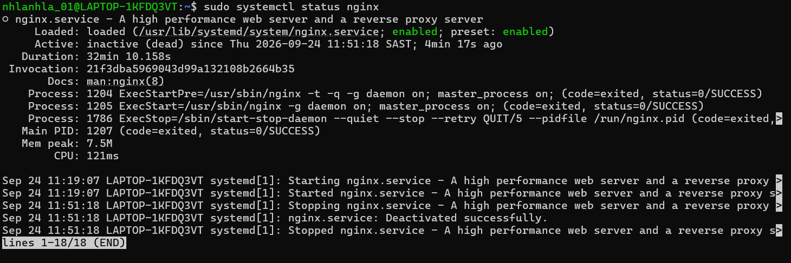
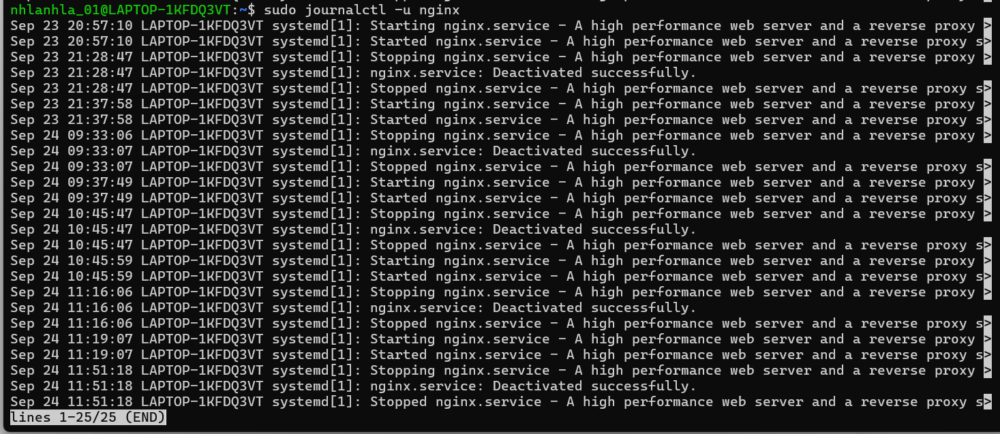

